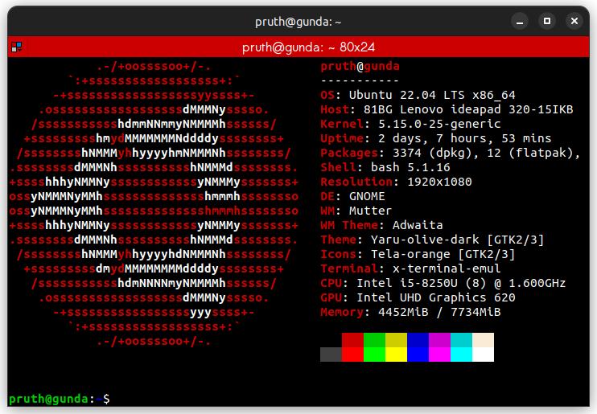
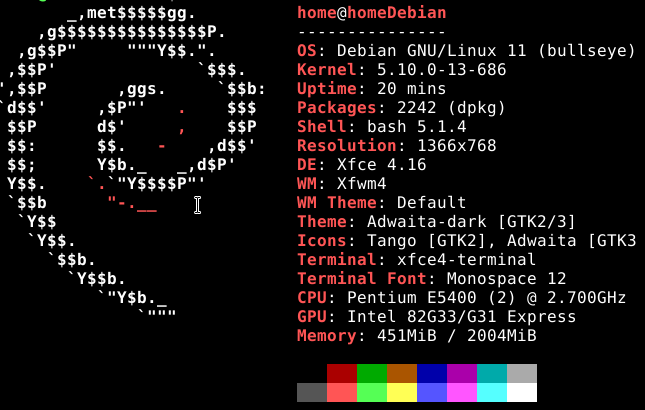

As of post writing, 14th May 2021: It's not a homelab per se, more of a "few things I have".

Currently I own a Laptop **Lenovo Ideapad 320** with i5 8th gen processor, 8 GB RAM DDR4 and 1 TB HDD and **13 year old desktop PC** with pentium processor, 2 GB RAM DDR3 and 500 GB HDD.

## 1. Laptop - Primary System 
On my primary system, the Laptop: I had Windows 10, but removed it entirely and wanted to dive deep into Linux. So, I installed Ubuntu as my base OS. It was torture at the beginning, now it's heaven.

The resources I have cannot support Virtualization. I/O delay in both Host OS and VM; RAM consumption shoot up to 95% due to lack of CPU (cores & cycles).

**Update (Nov 2022):** Triple Boot with **Kali** and **Arch Linux** (with blackarch repo availability) with **Ubuntu 22.10** (removed GNOME, Xfce is more responsive) system on Laptop for ease of installation of applications with required functionalities. 

1. Making use of different package managers 
2. Chance to rice OSes

## 2. Old PC 
The old desktop PC had a Windows 7 on it. Removed it to install Debian 11 Bullseye for 32 bit pc with Xfce Desktop Environment (lightest of the Debian variants).

But here's the caveat with the Debian system's Behaviour:\
when nothing is being done - CPU: 3% , Memory: 35%\
when firefox opened, one video played - CPU: 90% , Memory: 79%

Looks nice on a computer stand though.

## 3. Raspberry Pi 4 - 8GB RAM
In Aug 2021, I got a Raspberry Pi 4 8GB RAM, few 32 GB SD Cards and a 500GB SSD.\
I'm on a tight budget, the rPI4 was a big deal on my bank account.

So only 2 practically feasible systems available.

## Homelab

With time, I'll grow my homelab with the things I have (as of now writing: end of 2021). But I'll make do with the things I have.

When I get a new job in security I'll treat myself with a good workstation and start making and breaking things!